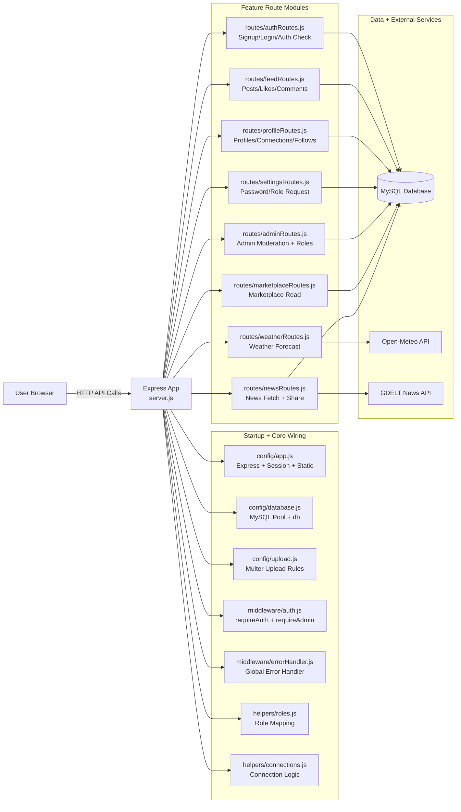

# Backend Architecture (Presentation Sheet)

## Mermaid Diagram

## 20-Second Talk Track

- The server entry file is now small and only wires modules.
- Config files prepare Express, database, and uploads.
- Middleware handles security checks and centralized errors.
- Each feature has its own route file, so responsibilities are isolated.
- Most modules use MySQL, while weather and news also call external APIs.

## Why This Is Better Than One Big server.js

- Easier to explain by feature.
- Easier to debug and maintain.
- Easier for team collaboration.
- Lower risk when changing one feature.
